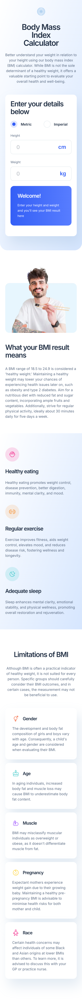
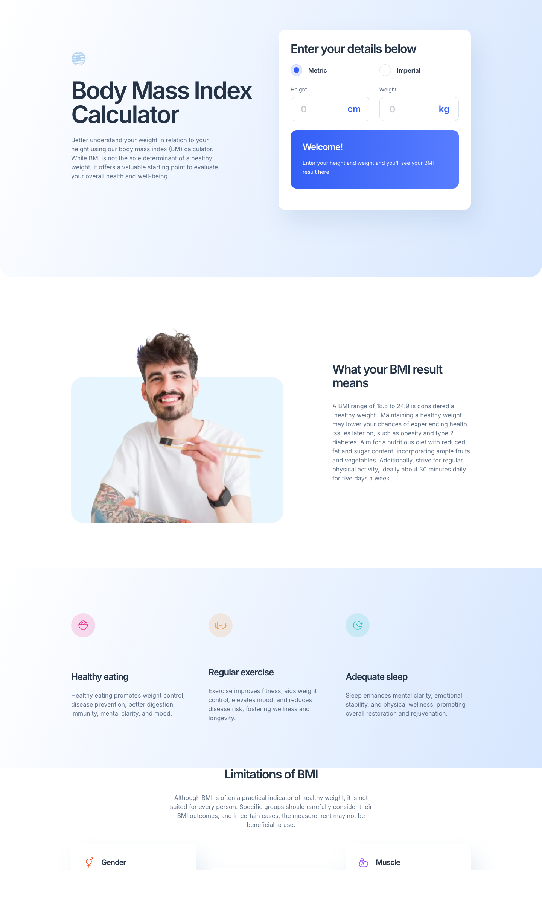

# Frontend Mentor - Body Mass Index Calculator solution

A responsive BMI calculator that lets users compute their Body Mass Index in metric or imperial units and instantly see their weight classification and ideal weight range. Built as a solution to the [Body Mass Index Calculator challenge on Frontend Mentor](https://www.frontendmentor.io/challenges/body-mass-index-calculator-brrBkfSz1T).


## Table of contents

- [Overview](#overview)
  - [The challenge](#the-challenge)
  - [Screenshots](#screenshots)
  - [Links](#links)
- [My process](#my-process)
  - [Built with](#built-with)
  - [What I learned](#what-i-learned)
  - [Project structure](#project-structure)
  - [Run locally](#run-locally)
  - [AI Collaboration](#ai-collaboration)
- [Author](#author)

## Overview

### The challenge

Users should be able to:

- Select whether they want to use metric or imperial units
- Enter their height and weight
- See their BMI result, with their weight classification and healthy weight range
- View the optimal layout for the interface depending on their device's screen size
- See hover and focus states for all interactive elements on the page

### Screenshots

**Mobile (375px)**



**Desktop (1440px)**



### Links

- Solution URL: _coming soon_
- Live Site URL: [fsdev-bmi-calculator-figma-dev.vercel.app](https://fsdev-bmi-calculator-figma-dev.vercel.app)

## My process

### Built with

- Semantic HTML5 markup (`header`, `main`, `section`, `article`, `aside`, `footer`)
- CSS custom properties as design tokens (colors, typography, spacing)
- CSS Grid & Flexbox for layout
- Mobile-first responsive workflow (breakpoints at 375px / 768px / 1440px)
- Vanilla JavaScript — no frameworks, no runtime dependencies
- [Vite](https://vitejs.dev/) as dev server and bundler

### What I learned

- **Design tokens in CSS.** Colors, typography scale, spacing, and radii are centralised in `src/css/tokens.css` as CSS custom properties. Tweaking the palette or type scale is a single-file change that propagates everywhere.
- **Imperial conversions that feel right.** Users enter feet + inches and stones + pounds as separate fields; the calculation module (`src/js/bmi.js`) normalises both sides to SI units (metres, kilograms) before applying the standard BMI formula `weight / height²`.
- **Live computation without a submit button.** Every input change recomputes the result. The empty state (`Welcome!` card) and populated state (`Your BMI is…`) share the same DOM container, swapped via a CSS class — no conditional rendering framework required.
- **Figma-first fidelity.** Spacing, font sizes, and gradient angles were pulled directly from the Figma file rather than eyeballed, which kept the 375/1440 screens 1:1 with the design spec.

### Project structure

```
src/
├── css/
│   ├── tokens.css      # CSS custom properties (colors, type, spacing)
│   ├── base.css        # Resets, typography, global element styles
│   ├── layout.css      # Grid/flex composition for main regions
│   └── responsive.css  # Breakpoint overrides (tablet / desktop)
├── js/
│   └── bmi.js          # Unit toggle + BMI calculation + DOM updates
└── index.html          # Semantic markup, single h1, single main
```

### Run locally

Prerequisites: Node.js >= 18.

```bash
git clone git@github.com:gusanchefullstack/fsdev-bmi-calculator-figma-dev.git
cd fsdev-bmi-calculator-figma-dev
npm install
npm run dev       # start Vite dev server at http://localhost:5173
npm run build     # production build to ./dist
npm run preview   # preview the production build locally
```

### AI Collaboration

Used Claude (Anthropic) to scaffold the Vite project, draft the design-token CSS, and wire the unit-conversion and BMI calculation logic. Reviewed each diff, adjusted responsive rules at 375/768/1440, and validated visually against the Figma source of truth.

## Author

<p align="left">
  <a href="https://www.linkedin.com/in/gustavosanchezgalarza/"></a>
  <a href="https://github.com/gusanchefullstack"></a>
  <a href="https://hashnode.com/@gusanchedev"></a>
  <a href="https://x.com/gusanchedev"></a>
  <a href="https://bsky.app/profile/gusanchedev.bsky.social"></a>
  <a href="https://www.freecodecamp.org/gusanchedev"></a>
  <a href="https://www.frontendmentor.io/profile/gusanchefullstack"></a>
</p>
